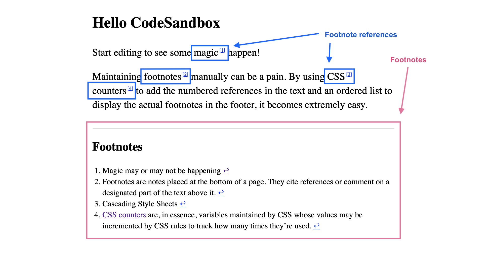

# react-a11y-footnotes

react-a11y-dialog is a thin React component to ease the use of accessible footnotes in React applications. This implementation is heavily inspired by [Accessible footnotes with CSS](https://www.sitepoint.com/accessible-footnotes-css/).

Find a [complete demo on CodeSandbox](https://codesandbox.io/s/footnotes-v34hm).

- [Install](#install)
- [Terminology](#terminology)
- [Usage](#usage)
- [API](#api)
  - [`FootnotesProvider`](#footnotesprovider)
  - [`FootnoteRef`](#footnoteref)
  - [`Footnotes`](#footnotes)
- [Styling](#styling)
  - [With CSS](#with-css)
  - [With CSS-in-JS](#with-css-in-js)
  - [Suggestions](#suggestions)
- [ID generation](#id-generation)
- [Example](#example)

## Install

```sh
npm install react-a11y-footnotes
```

## Terminology

- **Footnotes**: the additional information present at the bottom of a content area using footnote references.
- **Footnote reference**: a text segment offering more information in the footnotes.



## Usage

The library exports 3 parts, all necessary to make everything work correctly:

- `FootnotesProvider`: a component with no HTML footprint, that needs to wrap the content part of your application.
- `FootnoteRef`: an inline component wrapping a footnote reference, rendering an anchor link (`<a>`) to the correct footnote in the footer.
- `Footnotes`: a component rendering the actual footnotes, usually placed at the end of the content area.

## API

### `FootnotesProvider`

The `footnotesTitleId` prop can be passed to customise the `id` attribute assigned to the title rendered by `Footnotes` and referenced in every singled `FootnoteRef`.

If you are going to customise the `Title` prop from `Footnotes`, make sure to render `props.id` in the DOM, as this is how the value of `footnotesTitleId` is mapped between the references and the footnotes.

### `FootnoteRef`

The `FootnoteRef` renders a link like this:

```html
<a
  id="css-counters-ref"
  href="#css-counters-note"
  aria-describedby="footnotes-label"
  >CSS counters</a
>
```

- The `description` prop is mandatory and contains the content of the footnote. It can be a string or a React tree.
- The `id` prop can be passed to handle `id` manually, otherwise it is automatically generated from the reference content.
- The `style` and `className` props can be freely passed through in order to enable styling with CSS-in-JS libraries (see [Styling](#styling) section).

### `Footnotes`

The `Footnotes` component renders a HTML structure like this:

```html
<footer>
  <h2 id="footnotes-label">Footnotes</h2>
  <ol>
    <li id="css-counters-note">
      CSS counters are, in essence, variables maintained by CSS whose values may
      be incremented by CSS rules to track how many times they’re used.
      <a href="#css-counters-ref" aria-label="Back to content">↩</a>
    </li>
  </ol>
</footer>
```

- The `Wrapper` prop can be passed to customise the wrapper. It is `'footer'` by default to render a `<footer>` HTML element, and can accept any React component. This wrapper is technically not mandatory and could be replaced with a `React.Fragment`.

- The `Title` prop can be passed to customise the title. It is `props => <h2 {...props}>Footnotes</h2>` by default to render a title level 2 named “Footnotes”, and can accept any React component. This component can be [visually hidden](https://hugogiraudel.com/2016/10/13/css-hide-and-seek/) but **it should still be present accessible**!

- The `List` prop can be passed to customise the list. It is `'ol'` by default to render a `<ol>` HTML element, and can accept any React component.

- The `ListItem` prop can be passed to customise the list. It is `'li'` by default to render a `<li>` HTML element, and can accept any React component.

- The `BackLink` prop can be passed to customise the link back to the reference with each list item. If its content is non-descriptive (e.g. an icon), it is important it has an `aria-label` attribute with accessible content! By default, it is as below:

```js
const BackLink = props => (
  <a href={'#' + props.id} aria-label='Back to content'>
    ↩
  </a>
)
```

## Styling

Styling is left at the description of the author.

### With CSS

The library provides namespaced data attributes as styling anchors:

- `data-a11y-footnotes-ref`: applied to every single footnote reference
- `data-a11y-footnotes-footer`: applied to the footnotes wrapper
- `data-a11y-footnotes-title`: applied to the footnotes title
- `data-a11y-footnotes-list`: applied to the footnotes list
- `data-a11y-footnotes-list-item`: applied to every individual footnote
- `data-a11y-footnotes-back-link`: applied to every individual back link

### With CSS-in-JS

Given every component rendered by the `Footnotes` component is customisable, and `FootnoteRef` accept both `style` and `className`, integration with CSS-in-JS libraries should be relatively seamless.

For instance, the `FootnoteRef` could be wrapped as such with [Fela](https://fela.js.org):

```js
const refStyles = () => ({ color: 'deeppink' })
const Ref = createComponentWithProxy(refStyles, FootnoteRef)
```

And with [styled-components](https://styled-components.com):

```js
const Ref = styled(FootnoteRef)`
  color: deeppink;
`
```

### Suggestions

Here is the styling boilerplate which can be started from. Find a [complete demo on CodeSandbox](https://codesandbox.io/s/footnotes-v34hm?file=/src/styles.css:134-1558) to see how it looks.

```css
/**
 * 1. Initialiazing a `footnotes` counter on the content wrapper.
 *    `body` can be used if there is only one such wrapper per page
 *    otherwise something more specific should be used.
 */
body {
  counter-reset: footnotes; /* 1 */
}

[data-a11y-footnotes-footer] {
  /* Styles for the footnotes wrapper */
}

[data-a11y-footnotes-list] {
  /* Styles for the footnotes list */
}

/**
 * 1. Highlight the targeted footnote
 */
[data-a11y-footnotes-list-item]:target {
  background-color: yellow; /* 1 */
}

/**
 * 1. Visually make the back links a little smaller
 */
[data-a11y-footnotes-back-link] {
  font-size: 80%; /* 1 */
}

/**
 * Inline footnotes references
 * 1. Increment the counter at each new reference
 * 2. Reset link styles to make it appear like regular text
 */
[data-a11y-footnotes-ref] {
  counter-increment: footnotes; /* 1 */
  text-decoration: none; /* 2 */
  color: inherit; /* 2 */
  cursor: default; /* 2 */
  outline: none; /* 2 */
}

/**
 * Actual numbered references
 * 1. Display the current state of the counter (e.g. `[1]`)
 * 2. Align text as superscript
 * 3. Make the number smaller (since it’s superscript)
 * 4. Slightly offset the number from the text
 * 5. Reset link styles on the number to show it's usable
 */
[data-a11y-footnotes-ref]::after {
  content: '[' counter(footnotes) ']'; /* 1 */
  vertical-align: super; /* 2 */
  font-size: 50%; /* 3 */
  margin-left: 2px; /* 4 */
  color: blue; /* 5 */
  text-decoration: underline; /* 5 */
  cursor: pointer; /* 5 */
}

/**
 * 1. Reseting the default focused styles on the number
 */
[data-a11y-footnotes-ref]:focus::after {
  outline: thin dotted; /* 1 */
  outline-offset: 2px; /* 1 */
}
```

## ID generation

For a reference to link to its relevant footnote, and for the latter to provide a link back to the reference, there is an automatic system for resolving identifiers—regardless whether `id` is passed to the reference or not.

Consider a reference which receives an `id` prop named `foobar` (`<FootnoteRef id="foobar">`). The underlying anchor element will actually receive `foobar-ref` as an `id` (`<a id="foobar-ref">`). Similarly, the relevant footnote will receive `foobar-note` as an `id` (`<li id="foobar-note">`). This behaviour cannot be changed.

If no `id` is passed to references (`<FootnoteRef>`)—which is usually the case—the `id` will be computed from the content of the reference. For instance if the text says “CSS counters”, the resolved identifiers will be `css-counters-ref` and `css-counters-note`.

## Example

```js
import {
  FootnotesProvider,
  FootnoteRef as Ref,
  Footnotes,
} from 'react-a11y-footnotes'

const YourComponent = props => {
  return (
    <FootnotesProvider>
      <p>
        Maintaining{' '}
        <Ref description='Footnotes are notes placed at the bottom of a page. They cite references or comment on a designated part of the text above it.'>
          footnotes
        </Ref>{' '}
        manually can be a pain. By using{' '}
        <Ref description='Cascading Style Sheets'>CSS</Ref>{' '}
        <Ref
          id='with-a-custom-id'
          description={
            <>
              <a
                href='https://developer.mozilla.org/en-US/docs/Web/CSS/CSS_Lists_and_Counters/Using_CSS_counters'
                target='_blank'
                rel='noopener noreferrer'
              >
                CSS counters
              </a>{' '}
              are, in essence, variables maintained by CSS whose values may be
              incremented by CSS rules to track how many times they’re used.
            </>
          }
        >
          counters
        </Ref>{' '}
        to add the numbered references in the text and an ordered list to
        display the actual footnotes in the footer, it becomes extremely easy.
      </p>

      <Footnotes label='Footnotes' backLabel='Back to content' />
    </FootnotesProvider>
  )
}
```
